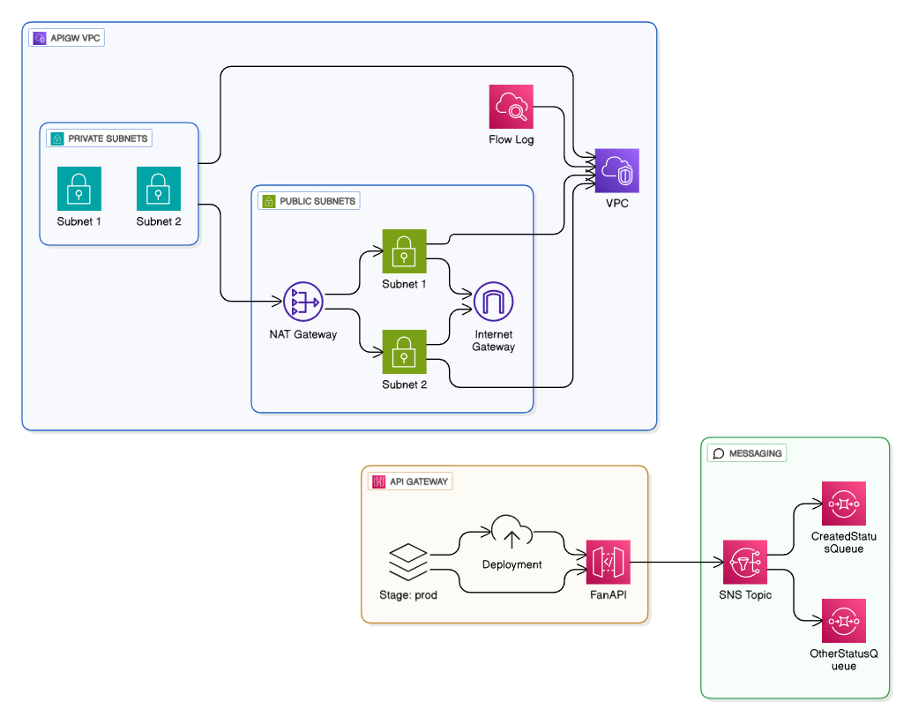
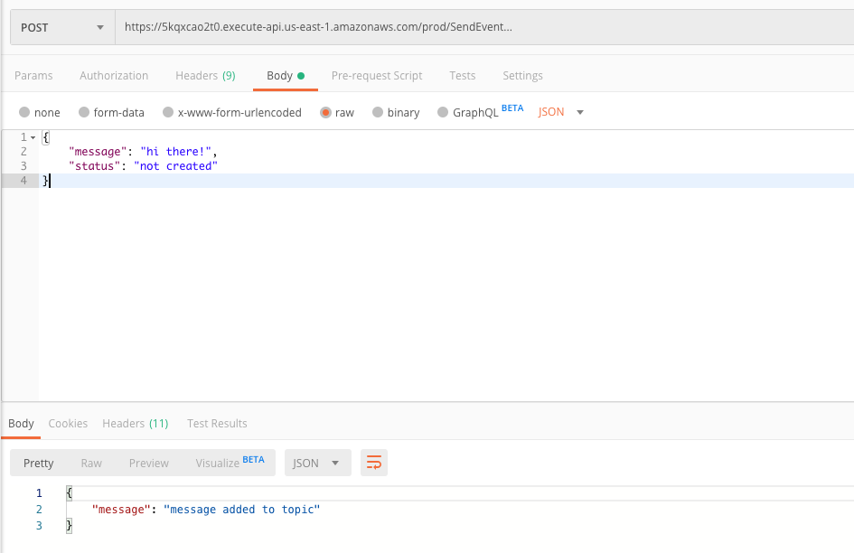

# AWS Private API Gateway with Fan-out Pattern

This project demonstrates a well-architected deployment of an AWS VPC with a Private API Gateway and a fan-out pattern using SNS and SQS.

## Architecture Overview



This architecture implements:

1. **Private API Gateway**: Securely deployed within a VPC, accessible only from within the network
2. **Fan-out Pattern**: Messages sent to the API are published to an SNS topic, which routes them to different SQS queues based on message attributes
3. **Lambda Processing**: Lambda functions process messages from the SQS queues
4. **Custom Domain**: API Gateway is accessible via a custom domain with proper Route53 and ACM integration
5. **Security**: Comprehensive security controls including WAF, VPC endpoints, and least privilege permissions
6. **Monitoring**: CloudWatch alarms, X-Ray tracing, and enhanced logging

### Key Components

- **VPC Infrastructure**: Private and public subnets, NAT gateway, and VPC endpoints
- **API Gateway**: Private REST API with custom domain, request validation, and throttling
- **SNS Topic**: Central message distribution with filtering capabilities
- **SQS Queues**: Message queues with dead-letter queues for error handling
- **Lambda Functions**: Event-driven processing with enhanced error handling and monitoring
- **WAF**: Web Application Firewall for API protection
- **CloudWatch**: Comprehensive monitoring and alerting

## New Features

The improved implementation includes:

- **Enhanced Security**:
  - AWS WAF integration for API Gateway protection
  - Request validation for API endpoints
  - Least privilege IAM permissions
  - Resource-based policies for API Gateway
  - VPC Flow Logs for network monitoring

- **Improved Reliability**:
  - Dead Letter Queues (DLQ) for SQS
  - Enhanced error handling in Lambda functions
  - Partial batch processing for SQS messages
  - Automatic retries with backoff

- **Better Monitoring**:
  - X-Ray tracing integration
  - CloudWatch alarms for critical metrics
  - Enhanced logging with structured formats
  - AWS Lambda Powertools integration

- **Performance Optimizations**:
  - API Gateway caching
  - Lambda function performance tuning
  - Throttling and quota management
  - Efficient error handling

- **Operational Excellence**:
  - Comprehensive tagging strategy
  - Type hints for better code quality
  - Modernized Python code structure
  - Updated to latest AWS CDK version

## Requirements

1. Create the top-level public forward zone in `Amazon Route53` 
2. Create a wildcard `Amazon Certificate Manager (ACM)` certificate request (e.g. `*.example.com`)
3. Replace the values in step #1 and #2 in `cdk.json` in `hosted_zone_id` and `hosted_zone_name` along with `cert_arn`
4. Set `custom_domain_name`, which will be the DNS record-set created (e.g. `api.example.com`)
5. (OPTIONAL) Set `vpc_cidr` to your preferred `Amazon VPC` CIDR block
6. Utilize AWS-CDK to `bootstrap`, `synth` and `deploy`

## Configuration Options

The `cdk.json` file contains the following configuration options:

```json
{
  "namespace": "apigw_fanout",
  "hosted_zone_id": "ZZ4353459fghEXAMPLE",
  "hosted_zone_name": "example.com",
  "cert_arn": "arn:aws:acm:us-east-?:replaceme:certificate/bf155d92-d49sdfg4353b2db396c1182",
  "custom_domain_name": "api.example.com",
  "alarm_email": "example@me.com",
  "vpc_cidr": "192.142.0.0/22",
  "use_improved_stack": "true",
  "environment": "dev",
  "owner": "cdk-deployment"
}
```

- `environment`: Deployment environment (dev, test, prod)
- `owner`: Owner of the deployment for tagging purposes

## API Usage

### JSON Payload Format

To send to the first lambda (created status):
```json
{ "message": "hello", "status": "created" }
```

To send to the second lambda (any other status):
```json
{ "message": "hello", "status": "not created" }
```

### Postman Example


## Deployment Instructions

### Prerequisites

- AWS CLI configured with appropriate credentials
- Node.js 18.x or later
- Python 3.9 or later
- AWS CDK v2 installed globally

### Setup

1. Clone the repository
2. Create and activate a Python virtual environment:

```bash
# Create virtual environment
python3 -m venv .env

# Activate on Linux/macOS
source .env/bin/activate

# Activate on Windows
.env\Scripts\activate.bat
```

3. Install dependencies:

```bash
pip install -r requirements.txt
```

4. Update the `cdk.json` file with your specific configuration values

### Deployment

1. Bootstrap the CDK environment (if not already done):

```bash
cdk bootstrap
```

2. Synthesize the CloudFormation template:

```bash
cdk synth
```

3. Deploy the stack:

```bash
cdk deploy
```

4. To destroy the stack when no longer needed:

```bash
cdk destroy
```

## Testing

After deployment, you can test the API using:

1. **Postman**: Send POST requests to the API endpoint with appropriate JSON payloads
2. **curl**: Use curl commands to test the API:

```bash
# Replace with your actual API endpoint and API key
curl -X POST \
  https://api.example.com/apigw_fanout/SendEvent \
  -H 'Content-Type: application/json' \
  -H 'x-api-key: your-api-key' \
  -d '{"message": "hello", "status": "created"}'
```

3. **AWS Console**: Check CloudWatch Logs to verify Lambda function execution

## Monitoring and Troubleshooting

- **CloudWatch Logs**: Check Lambda function logs for execution details
- **CloudWatch Metrics**: Monitor API Gateway, Lambda, SNS, and SQS metrics
- **X-Ray Traces**: Analyze request flows and identify bottlenecks
- **CloudWatch Alarms**: Set up notifications for critical issues

## Security Considerations

- The API Gateway is deployed as a private endpoint, accessible only from within the VPC
- WAF rules protect against common web vulnerabilities
- VPC endpoints provide secure access to AWS services without traversing the public internet
- Least privilege IAM permissions restrict access to resources
- Request validation prevents malformed requests

## Useful CDK Commands

* `cdk ls`          list all stacks in the app
* `cdk synth`       emits the synthesized CloudFormation template
* `cdk deploy`      deploy this stack to your default AWS account/region
* `cdk diff`        compare deployed stack with current state
* `cdk docs`        open CDK documentation

## Contributing

Contributions are welcome! Please feel free to submit a Pull Request.

## License

This project is licensed under the MIT License - see the LICENSE file for details.