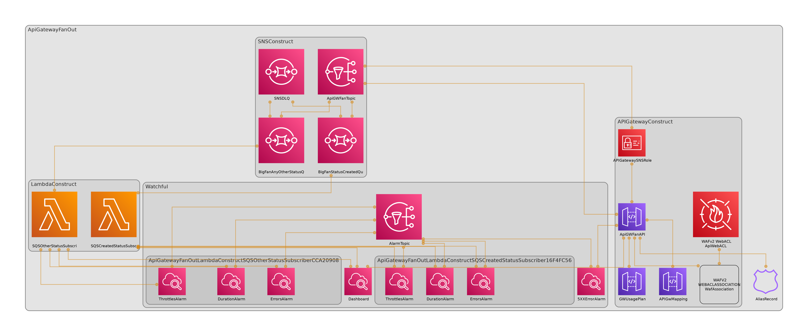

# An AWS Well-Architected Deployment of an AWS VPC + AWS API-Gateway (Private API) + Fanout

## Requirements

1. Create the top-level public forward zone in `Amazon Route53` 
2. Create a wildcard `Amazon Certificate Manager (ACM)` certificate request (e.g. `*.example.com`)
3. Replace the values in step #1 and #2 in `cdk.json` in `hosted_zone_id` and `hosted_zone_name` along with `cert_arn`
4. Set `custom_domain_name`, which will be the DNS record-set created (e.g. `api.example.com`)
5. (OPTIONAL) Set `vpc_cidr` to your preferred `Amazon VPC` CIDR block
6. Utilize AWS-CDK to `bootstrap`, `synth` and `deploy`

## Inventory

- (1) `Amazon VPC` that is provisioned with private subnets
- (4) `Amazon VPC` Interface Endpoints for the services deployed (SNS, SQS, Lambda, NLB)
- (1) `AWS API Gateway` (using a Private API) that will route traffic to the respective endpoints
- (1) `AWS API Gateway` mapping
- (1) `Amazon Route53` record-set for the custom domain
- (1) `Amazon SNS` Topic
- (2) `Amazon SQS` Queues
- (2) `AWS Lambda` functions that are invoked by the `Amazon SQS` queues 

## Fanout Details
The "/SendEvent" endpoint will take a POST request with a JSON payload. The payload formats are beneath.

When API Gateway receives the json it automatically through VTL routes it to an SNS Topic, this Topic then has two subscribers which are SQS Queues. The difference between the two subscribers is that one looks for a property of "status":"created" in the json and the other subscriber looks for any message that doesn't have that property. Each queue has a lambda that subscribes to it and prints whatever message it recieves to cloudwatch.




### JSON Payload Format

To send to the first lambda
`{ "message": "hello", "status": "created" }`

To send to the second lambda
`{ "message": "hello", "status": "not created" }`

### Postman Example


## Useful CDK Commands

The `cdk.json` file tells the CDK Toolkit how to execute your app.

This project is set up like a standard Python project.  The initialization
process also creates a virtualenv within this project, stored under the .env
directory.  To create the virtualenv it assumes that there is a `python3`
(or `python` for Windows) executable in your path with access to the `venv`
package. If for any reason the automatic creation of the virtualenv fails,
you can create the virtualenv manually.

To manually create a virtualenv on MacOS and Linux:

```
$ python3 -m venv .env
```

After the init process completes and the virtualenv is created, you can use the following
step to activate your virtualenv.

```
$ source .env/bin/activate
```

If you are a Windows platform, you would activate the virtualenv like this:

```
% .env\Scripts\activate.bat
```

Once the virtualenv is activated, you can install the required dependencies.

```
$ pip install -r requirements.txt
```

At this point you can now synthesize the CloudFormation template for this code.

```
$ cdk synth
```

To add additional dependencies, for example other CDK libraries, just add
them to your `setup.py` file and rerun the `pip install -r requirements.txt`
command.

## Useful commands

 * `cdk ls`          list all stacks in the app
 * `cdk synth`       emits the synthesized CloudFormation template
 * `cdk deploy`      deploy this stack to your default AWS account/region
 * `cdk diff`        compare deployed stack with current state
 * `cdk docs`        open CDK documentation
